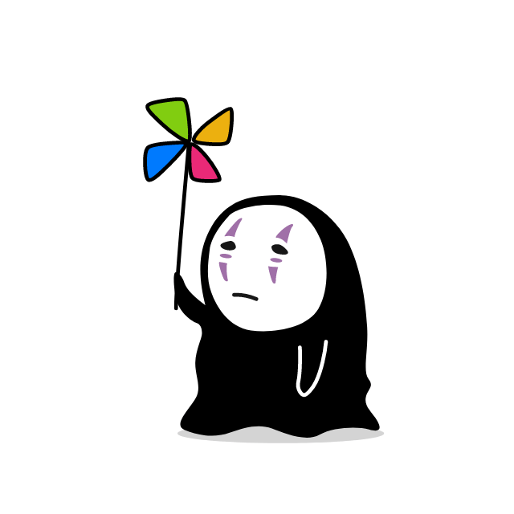

<style>
h1 {font-family: "Roboto"}
.img-wrapper {text-align: center;, margin: auto;}
</style>

<h1 style="text-align: left;font-size:50px;font-weight:800">Hi there, I'm Eoan 👋</h1>

<div class="img-wrapper"></div>
    
```javascript

const eoan = {
    about: "👨🏻‍💻 Computer Science Masters student & Owner @ WebSpace",
    workingOn: [
        "Masters in Software Engineering & Green IT @ Vrije Universiteit",
        "Running WebSpace",
        "Recruiting new engineers for freelance work",
    ],
    learning: [Dart, GraphQL, MikroORM, Apollo, C++],
    technologies: {
        frontend: {
            frameworks: [React, Vue, Gatsby, Flutter, ReactNative, SwiftUI],
            css: [MaterialUI, Bootstrap, Atlassian],
        },
        backend: [Docker, Node, GraphQL, Express, Laravel, PHP, WordPress, AWS],
        databases: [MongoDB, MySQL, PostgreSQL],
    },
};

````

</h3>


[](https://www.linkedin.com/in/eoanodea/)

[](https://about.eoan.ie)
[](https://web-space.design/)
[](https://discord.gg/4eEcsSMYXX)

[](https://github.com/eoanodea/eoanodea/actions/workflows/main.yml)